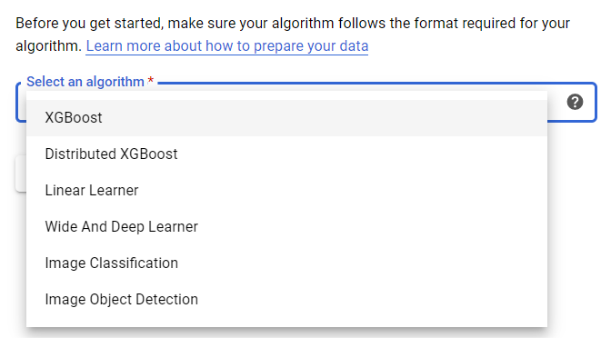

# Documentation

## Structure

* 분석 시나리오 선정
  * 분석 알고리즘 선정
  * Data 선정
  * 분석업무 예시 수립

* Cloud Service 활용 예시 작성
  * GCP
  * Azure

---

* 분석 시나리오 선정
  * 분석 알고리즘 선정: `resnet`(Image Classification), `retinanet`(Object Detection)
    > * __**`tensorflow` 선정**__
    > GPU 활용을 위한 대표 Framework {`tensorflow`, `spark`} 중
    > DL을 포괄하고, `tfx`(tensorflow extended)에 바로 적용 가능
    > * __**`retinanet` 선정**__
    >>`bert`, `resnet`, `retinanet`, `wide & deep`: `tensorflow` 공식 제공 모델 [link](https://github.com/tensorflow/models/tree/master/official)
    > Market Caster 사례와 비교 전에, 개발을 위한 빠른 알고리즘/데이터 확보 필요성 고려
    > Public Cloud와 비교검증을 위해 Google Cloud에 내장된 알고리즘 리스트 확인 [link](https://cloud.google.com/ai-platform/training/docs/algorithms/overview)
    > 

  * Data 선정
    | Dataset | Usage | Categories | Image Size | Data Size |
    | :------ | :------ | :------ | :------ | :------ |
    | __**MS Coco**__ | Obejct Segmentation Recognition in context | 80 classes | 640x480 | 330K images, 200K labeled, 42.7GB |
    | ~~CIFAR100~~ | Image Classification/ Object Recognition | 20 classes (100 subclasses) | ~~32x32~~ | 50k(training)/10k(test) images, ~~161 MB~~ |
    | ImageNet | Image Classification/ Object Recognition | 1K classes | 469x397(Avg.) | 1.4M images, >200GB |
    | Core50 | __*Continual*__ Learning and Object Recognition, Detection, Segmentation | 50 classes | 350x350 (128x128 cropped) | 164K images, 25.8GB |

      - 기타 데이터셋 참고
        * [deeplearning.net](http://deeplearning.net/datasets/)
        * [pathmind.com](https://pathmind.com/wiki/open-datasets)

  * 분석업무 예시 수립

* Cloud Service 활용 예시 작성
  * GCP
  * [Azure ML Studio(Preview)](https://ml.azure.com/visualinterface/authoring/Normal/7b2c2cc3-fbf6-4fbc-ad5f-6d6e3fad57d4?wsid=/subscriptions/5c48f2ce-c4d7-487f-9027-7c3cc6878f24/resourcegroups/am-rgroup/workspaces/aml-test&tid=ce4d6c9f-ae3d-4308-86ca-1171c59fcf8e)

