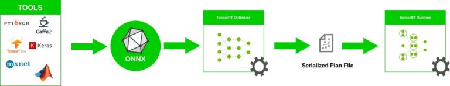
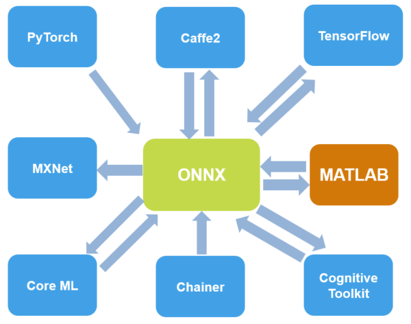

# ONNX

* onnx-tensorflow
> ONNX-TF requires ONNX (Open Neural Network Exchange) as an external dependency, for any issues related to ONNX installation, we refer our users to ONNX project repository for documentation and help. Notably, please ensure that protoc is available if you plan to install ONNX via pip.
> 
> The specific ONNX release version that we support in the master branch of ONNX-TF can be found here. This information about ONNX version requirement is automatically encoded in setup.py, therefore users needn't worry about ONNX version requirement when installing ONNX-TF.
> 
> To install the latest version of ONNX-TF via pip, run pip install onnx-tf.
> 
> Because users often have their own preferences for which variant of Tensorflow to install (i.e., a GPU version instead of a CPU version), we do not explicitly require tensorflow in the installation script. It is therefore users' responsibility to ensure that the proper variant of Tensorflow is available to ONNX-TF. Moreoever, we require Tensorflow version == 1.15.0.

* onnx version

ONNX version|File format version|Opset version ai.onnx|Opset version ai.onnx.ml|Opset version ai.onnx.training
------------|-------------------|---------------------|------------------------|------------------------------
1.0|3|1|1|-
1.1|3|5|1|-
1.1.2|3|6|1|-
1.2|3|7|1|-
1.3|3|8|1|-
1.4.1|4|9|1|-
1.5.0|5|10|1|-
1.6.0|6|11|2|-
1.7.0|7|12|2|1