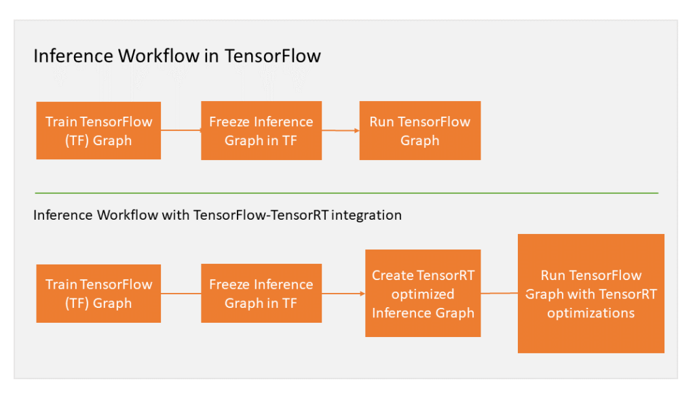
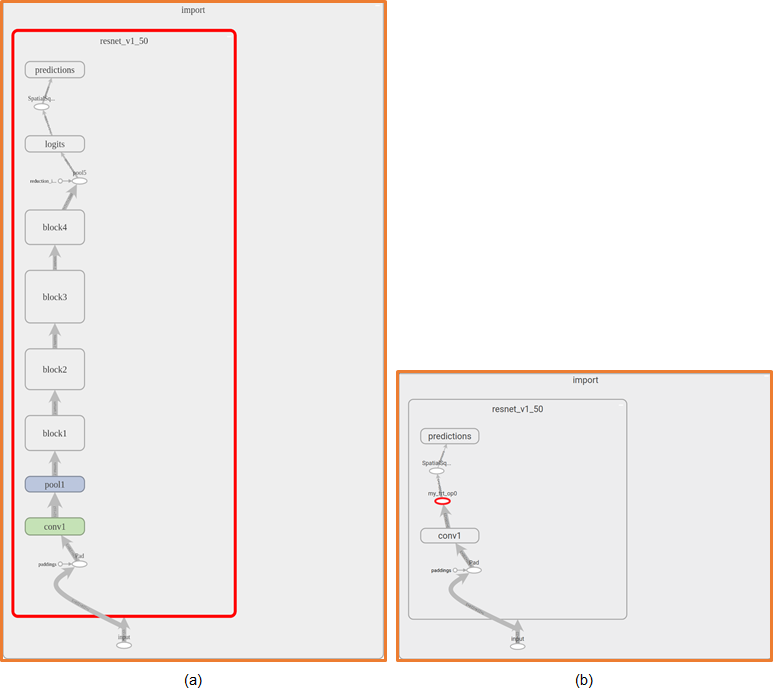

# TensorRT

TensorRT: NVIDIA's SDK for high-performance deep learning inference. It includes a deep learning inference optimizer and runtime DL Inference Accelerator

[NVIDIA Dev. Blog: How to Speed Up Deep Learning Inference Using TensorRT (2018.11)](https://devblogs.nvidia.com/speed-up-inference-tensorrt/)
[NVIDIA Dev. Blog: Speeding up Deep Learning Inference Using TensorFlow, ONNX, and TensorRT (2020.03)](https://devblogs.nvidia.com/speeding-up-deep-learning-inference-using-tensorflow-onnx-and-tensorrt/)
[NVIDIA Dev. Blog: TensorRT Integration Speeds Up TensorFlow Inference(2018.03)](https://devblogs.nvidia.com/tensorrt-integration-speeds-tensorflow-inference/)






Compatibility
‣ TensorRT 7.0.0 has been tested with the following:
‣ cuDNN 7.6.5
‣ TensorFlow 1.14.0
‣ PyTorch 1.3.0
‣ ONNX 1.6.0
‣ This TensorRT release supports CUDA 9.0, 10.0, and 10.2.
‣ For PowerPC users, Tesla V100 and Tesla T4 GPUs are supported.
[Ref: TensorRT release note](TensorRT-Release-Notes.pdf)


* tensorrt

> It should be installed on `root`. It can cause errors without `root` privilege.

```sh
os=”ubuntu1x04”
tag=”cudax.x-trt7.x.x.x-ga-yyyymmdd”
sudo dpkg -i nv-tensorrt-repo-${os}-${tag}_1-1_amd64.deb
sudo apt-key add /var/nv-tensorrt-repo-${tag}/7fa2af80.pub

sudo apt-get update
sudo apt-get install tensorrt

sudo apt-get install python3-libnvinfer-dev # python-libnvinfer-dev
sudo apt-get install uff-converter-tf


os=”ubuntu1x04”
tag=”cudax.x-trt7.x.x.x-ga-yyyymmdd”
sudo dpkg -i nv-tensorrt-repo-${os}-${tag}_1-1_amd64.deb
sudo apt-key add /var/nv-tensorrt-repo-${tag}/7fa2af80.pub

sudo apt-get update
sudo apt-get install libnvinfer7
sudo apt-get install protobuf-compiler libprotoc-dev

```

```sh

pip install 'pycuda>=2019.1.1'

```